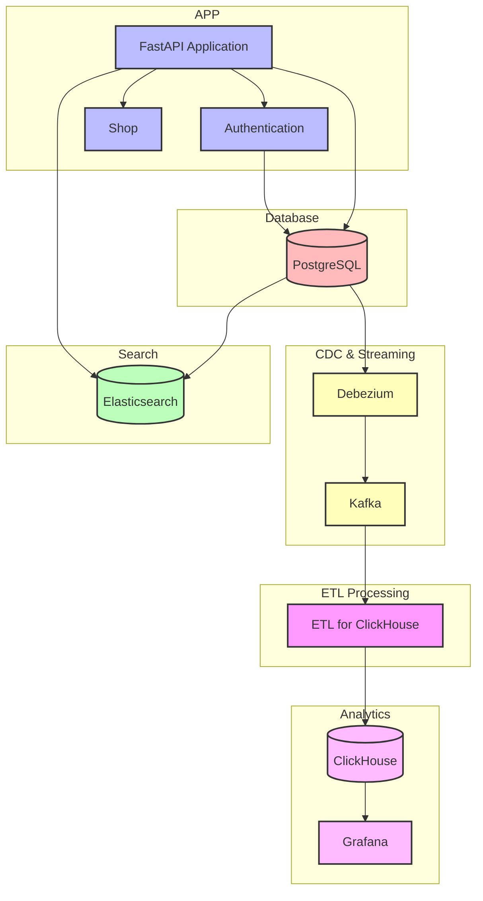

# Архитектура приложения и поиска

## Компоненты системы

### 1. API и приложение

- **FastAPI**: Основное приложение
  - REST API для работы с продуктами
  - Аутентификация и авторизация
  - Управление заказами
  - Интеграция с Elasticsearch

### 2. Поиск и индексация

- **Elasticsearch**: Поисковый движок
  - Индексация продуктов
  - Полнотекстовый поиск
  - Фильтрация и агрегации
  - Автодополнение и подсказки

### 3. База данных

- **PostgreSQL**: Основное хранилище данных
  - Продукты и их варианты
  - Пользователи и продавцы
  - Заказы и транзакции

## Диаграмма архитектуры

## Особенности реализации

### 1. Поисковая система

- **Индексация продуктов**:
  - CDC через Debezium → Kafka
  - ETL-процессор читает данные из Kafka и индексирует в Elasticsearch
  - Автоматическая индексация при изменениях в PostgreSQL
  - Периодическая полная переиндексация
  - Инкрементальное обновление индекса

- **Поисковые возможности**:
  - Полнотекстовый поиск по названию и описанию
  - Фильтрация по категориям и атрибутам
  - Сортировка по релевантности и цене
  - Автодополнение и подсказки

### 2. API и приложение

- **REST API**:
  - CRUD операции для продуктов
  - Управление заказами
  - Аутентификация и авторизация
  - Rate limiting и кэширование

- **Интеграции**:
  - Чтение из Elasticsearch
  - Отправка событий в Kafka
  - Мониторинг и логирование

### 3. Масштабирование

- **Горизонтальное масштабирование**:
  - Несколько инстансов FastAPI
  - Кластер Elasticsearch
  - Репликация PostgreSQL
  - Множество партиций в Kafka
  - Несколько ETL-процессоров

- **Оптимизация производительности**:
  - Кэширование в Redis
  - Асинхронная обработка
  - Оптимизированные запросы

## Потоки данных

1. **Создание/обновление продукта**:
   - FastAPI → PostgreSQL
   - PostgreSQL → Debezium → Kafka
   - Kafka → ETL-процессор → Elasticsearch
   - Kafka → ETL-процессор → ClickHouse

2. **Поиск продуктов**:
   - FastAPI → Elasticsearch
   - Кэширование результатов
   - Агрегация и фильтрация

3. **Аналитика**:
   - События → Kafka → ETL-процессор → ClickHouse
   - ClickHouse → Grafana
   - Мониторинг и метрики 