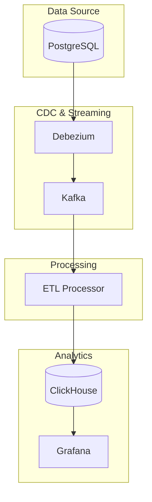

# Архитектура онлайн-магазина

## Компоненты системы

### 1. Источники данных

- **PostgreSQL**: Хранение реляционных данных
  - Пользователи (users)
  - Продукты (products)
  - Продавцы (sellers)
  - Заказы (orders)
  - Элементы заказов (order_items)

### 2. Сбор данных (CDC)

- **Debezium**: Отслеживание изменений в PostgreSQL
  - Конфигурация через postgres-connector.json
  - Настройка фильтрации таблиц и схем
  - Поддержка снэпшотов и инкрементальных изменений

- **Kafka**: Промежуточное хранение потоковых данных
  - Топики для каждой таблицы
  - Настройка репликации и партиционирования
  - Мониторинг через JMX

### 3. Обработка данных

- **ETL Processor**: Python-сервис для обработки потоковых данных
  - Чтение данных из Kafka
  - Трансформация и обогащение данных
  - Запись в ClickHouse

### 4. Хранение и аналитика

- **ClickHouse**: Хранение и анализ данных
  - Оптимизированная структура таблиц
  - Эффективные агрегации

- **Grafana**: Визуализация данных
  - Дашборды для анализа продаж
  - Мониторинг ключевых метрик
  - Настраиваемые временные интервалы

## Диаграмма ETL-pipeline

## Особенности реализации

1. **Масштабируемость**:
   - Горизонтальное масштабирование Kafka
   - Распределенная обработка в ETL
   - Оптимизированные запросы в ClickHouse

2. **Отказоустойчивость**:
   - Репликация данных в Kafka
   - Механизмы восстановления в Debezium
   - Мониторинг состояния компонентов

3. **Производительность**:
   - Эффективная обработка потоковых данных
   - Оптимизированные запросы в ClickHouse
   - Кэширование в Grafana

4. **Безопасность**:
   - Защита паролей в конфигурации
   - Контроль доступа к данным
   - Безопасное хранение конфигураций

## Потоки данных

1. **Потоковый режим**:
   - PostgreSQL → Debezium → Kafka → ETL Processor → ClickHouse
   - Непрерывная обработка в реальном времени
   - Визуализация в Grafana
