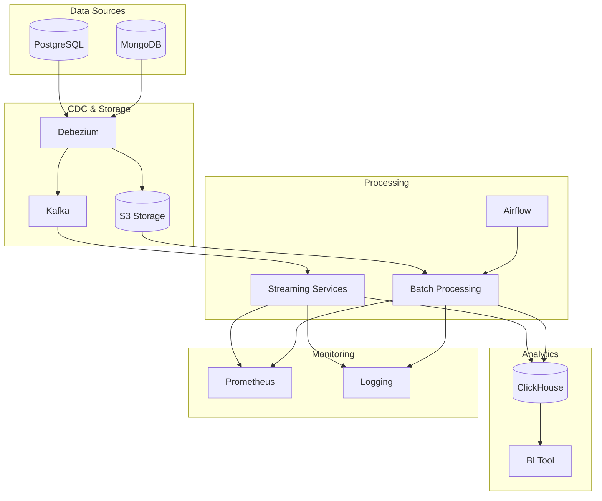

# Архитектура онлайн-магазина

## Общее описание

Система представляет собой распределенное приложение для онлайн-магазина с поддержкой аналитики и поиска. Архитектура построена с учетом требований к масштабируемости, отказоустойчивости и производительности.

## Компоненты системы

### 1. Источники данных

- **PostgreSQL**: Хранение реляционных данных (продукты, пользователи, продавцы, авторизация)
- **MongoDB**: Хранение событий (покупки, отмены заказов, рейтинги)

### 2. Сбор данных (CDC)

- **Debezium**: Отслеживание изменений в источниках данных
- **Kafka**: Промежуточное хранение потоковых данных
- **S3**: Хранение исторических данных в формате Iceberg/Hudi/Deltalake

### 3. Обработка данных

#### Streaming Pipeline

- Python-сервисы для обработки потоковых данных
- REST/GRPC/Kafka для межсервисного взаимодействия
- Модель данных Data Vault или Snowflake в ClickHouse

#### Batch Pipeline

- Batch framework (Spark/Flink/Trino)
- Ежедневное обновление через Airflow
- Корректировка данных из streaming pipeline

### 4. Хранение и аналитика

- **ClickHouse**: Хранение обработанных данных
- **BI-инструмент** (Superset/Metabase/Redash/DataLens): Визуализация данных

### 5. Мониторинг и логирование

- **Prometheus**: Сбор метрик
- **ELK Stack**: Сбор и анализ логов
- **Tracing**: Отслеживание запросов в микросервисной архитектуре

## Диаграмма архитектуры

## Особенности реализации

1. **Масштабируемость**:
   - Горизонтальное масштабирование компонентов
   - Разделение на микросервисы
   - Использование очередей для асинхронной обработки

2. **Отказоустойчивость**:
   - Репликация данных
   - Механизмы восстановления после сбоев
   - Мониторинг состояния системы

3. **Производительность**:
   - Кэширование на разных уровнях
   - Оптимизация запросов
   - Балансировка нагрузки

4. **Безопасность**:
   - Шифрование данных
   - Защита паролей (хеширование)
   - Контроль доступа

## Потоки данных

1. **Потоковый режим**:
   - CDC → Kafka → Streaming Services → ClickHouse
   - Непрерывная обработка в реальном времени
   - Восстановление с последней точки при сбоях

2. **Пакетный режим**:
   - S3 → Batch Processing → ClickHouse
   - Ежедневное обновление через Airflow
   - Корректировка данных из streaming pipeline
